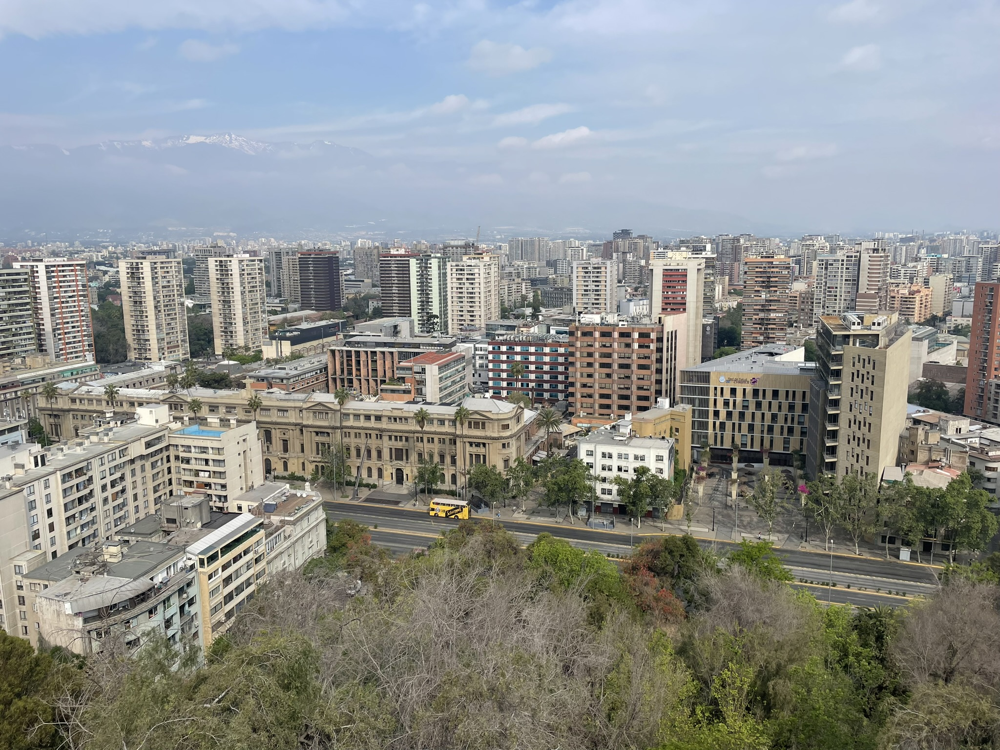

In construction... 

Santiago is renowned for its towering mountains, the Cordillera de los Andes, as well as its smaller yet significant hills, San Cristóbal and Santa Lucía. In these high altitudes live the condors, an important bird for the civilizations near the Andes.

|| 
|:-:|
|*Condor andino*|

If we adopt the point of view of the condors, the details leave the main scene and the relationships between objects take the spotlight. Thus, we can interpret this from a categorical point of view of Santiago. In this post, we are going to explore and explain some of these high points.

Santa Lucía hill, with a relative height (prominence) of 68 meters, is not very high compared to its neighbor, San Cristóbal hill, which has a relative height of 280 meters. However, what it lacks in altitude, it makes up for in attitude. Here, one can find hermitages, cannons, multiple statues, fountains, a castle, and more—all within 6.5 hectares. All these can be found in the [Album de Santa Lucía](https://www.memoriachilena.gob.cl/archivos2/pdfs/MC0006534.pdf).

||
|:-:|
|Album de Santa Lucía|

This hill has not always been glamorous; the natives called it Huelén, meaning melancholy, sadness, or pain. The transformation was made possible by Benjamin Vicuña Mackenna, who, inspired by his trips to Europe and North America, decided in 1872 to refurbish the hill. In his own words, "that threefold marvel of nature, history, and urban life yearned for a common laborer who could envision its transformation into a cornerstone of the modern metropolis."

||
|:-:| 
|South entrance|

Of course, there are many places to visit in these hills, so we will only see some glimpses of the views you can have in Santa Lucía hill. It has different levels, but we will concentrate on the highest ones. From here, we can look at Alameda, the main street in Santiago.

||
|:-:| 
|Main Street: Alameda|

As such, on the street, many activities happen—demonstrations, political speeches, sports events, etc. Beneath this street is Line 1, also the spine of the metro system. It connects with all lines of the metro system. Let us look in the west direction. From this side, we can see different buildings such as churches and museums. The National Library and San Francisco Church, an iconic church in Santiago.

||
| :----: |
| San Cristóbal hill |

Finally, looking to the northeast, we can see San Cristóbal hill, our next destination.

||
| :----: |
| San Cristóbal hill |

San Cristóbal hill. This iconic hill is a park with 722 hectares, one of the largest in the world. This park is called [Parquemet](https://parquemet.cl/). It has pools, cable cars, funiculars, a zoo, a botanical garden, a sanctuary, an astronomical observatory, etc. Due to the great extent of this hill, we will only highlight some of its high points. First, perhaps the most well-known, the summit. It has a sculpture of the Immaculate Conception.

||
|:-:|
|Immaculate Conception|

If we look to the southeast, we can now see again Santa Lucía hill, along with Alameda Street. We can also see the main river of Santiago, the Mapocho River.

||
|:-:|
|Santa Lucía hill|

Finally, if we look to the west, we can see the Andes alongside the big commercial and administrative tower, Costanera Center.

||
| :----: |
| West |

These are just two categorical views emerging from the hills of Santiago. We encourage the reader to explore these and discover new ones.
